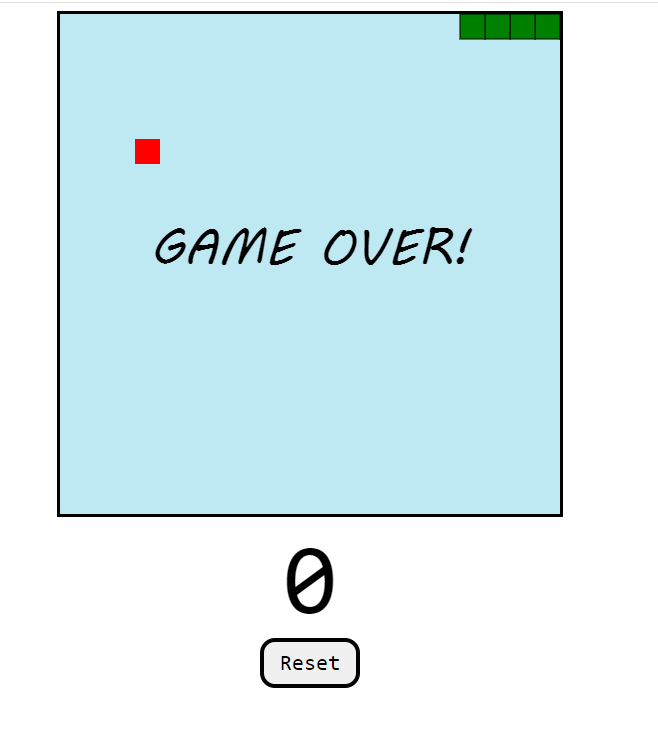

# snakeGame

## Overview

This is a basic Snake game built with HTML5 Canvas and JavaScript. The game allows players to control a snake, eat food, and grow longer while avoiding collisions with the walls and itself.

## How to Play

1. Open the HTML file in a web browser.
2. Use the arrow keys (Up, Down, Left, Right) to control the snake's direction.
3. Eat the red food to grow longer and increase your score.
4. Avoid collisions with the walls and the snake's own body.
5. Click the "Reset" button to start a new game.

## Technologies Used

- HTML5 Canvas
- JavaScript

## App

